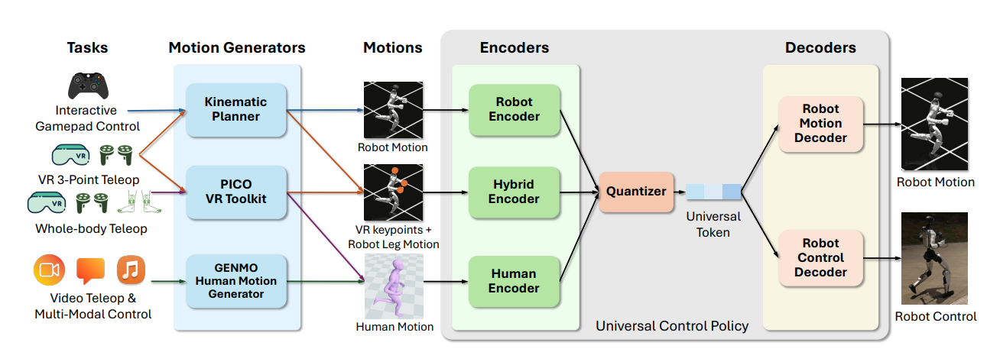

Motion 可以理解为：**比速度命令更丰富的 command**

问：**planner本身不就是我现在做的locomotion吗：输入稀疏指令，输出动作？**

答：planner 确实像一个 locomotion 模块：输入稀疏指令，生成“走路相关的东西”；
planner 输出的不是机器人马上执行的 **action**，而是一段“未来参考动作 **Motion**”，类似：
~~~markdown
未来 1 秒：
    pelvis 应该在哪里
    身体朝向应该怎样
    29 个关节角大概是什么
~~~
他不处理底层控制器要解决的：
~~~markdown
脚底接触误差
地面反作用力
机器人实际滞后
关节执行偏差
摔倒恢复
IMU 扰动
动力学可执行性
~~~

真正输出 action 的是 SONIC 的 Robot Control Decoder，SONIC 根据真实机器人当前状态，决定现在该输出什么 29 维关节 action。