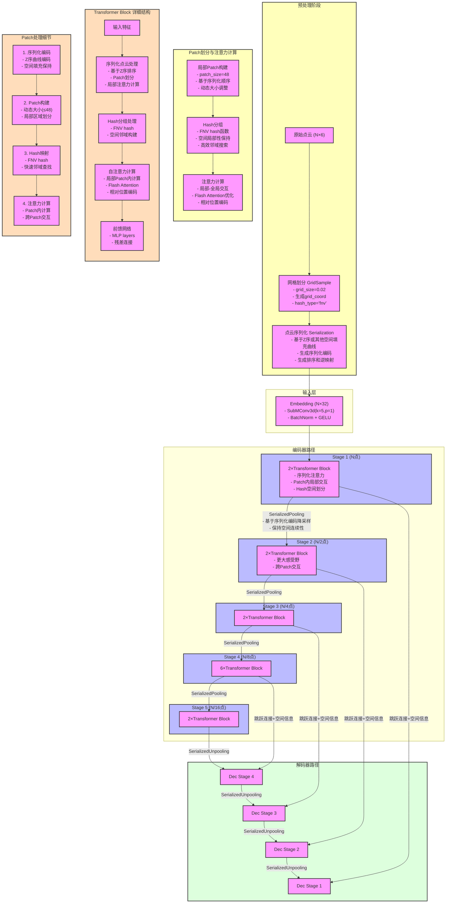

CUDA：为“GPU通用计算”构建的运算平台。
cudnn：为深度学习计算设计的软件库。

CUDA Toolkit (nvidia)： CUDA完整的工具安装包，其中提供了 Nvidia 驱动程序、开发 CUDA 程序相关的开发工具包等可供安装的选项。包括 CUDA 程序的编译器、IDE、调试器等，CUDA 程序所对应的各式库文件以及它们的头文件。

CUDA Toolkit (Pytorch)： CUDA不完整的工具安装包，其主要包含在使用 CUDA 相关的功能时所依赖的动态链接库。不会安装驱动程序。
（NVCC 是CUDA的编译器，只是 CUDA Toolkit 中的一部分）
注：==CUDA Toolkit 完整和不完整的区别：在安装了CUDA Toolkit (Pytorch)后，只要系统上存在与当前的 cudatoolkit 所兼容的 Nvidia 驱动，则已经编译好的 CUDA 相关的程序就可以直接运行，不需要重新进行编译过程。如需要为 Pytorch 框架添加 CUDA 相关的拓展时（Custom C++ and CUDA Extensions），需要对编写的 CUDA 相关的程序进行编译等操作，则需安装完整的 Nvidia 官方提供的 CUDA Toolkit。==

```python
onda install pytorch==2.1.0 torchvision==0.16.0 torchaudio==2.1.0 pytorch-cuda=11.8 -c pytorch -c nvidia #会安装pytorch的cuda
```

​	笔者在 /home/test/cuda-10.1 目录中安装了 cuda-10.1 ，而服务器上的 /usr/local/cuda 目录指向的是之前安装的老版本的 cuda-8.0，直接运行 Pytorch 时，其==会基于上面的确认流程直接使用老版本的 cuda .若想要临时设置 Pytorch 使用新安装的 cuda ，则可以通过 export 命令修改全局变量。这种设置方式在当前终端退出后即失效。==

```python
export CUDA_HOME=/home/test/cuda-10.1/        　　　//设置全局变量 CUDA_HOME
export PATH=$PATH:/home/test/cuda-10.1/bin/        //在 PATH 变量中加入需要使用的 cuda 版本的路径,使得系统可以使用 cuda 提供的可执行文件，包括 nvcc
```


**使用conda命令安装pytorch时候cudatoolkit的版本是哪个？**
	答： 我们只需要根据项目代码要求来确定cudaoolkit包的版本，安装相应的pytorch即可，如算法需要cuda10.2，那么就可以conda install pytorch torchvision cudatoolkit=10.2 -c pytorch。
上述命令在使conda安装torch时候，会提供一个cudatoolkit工具包，其中包含了CUDA的运行API(主要是一些动态链接库文件libXXXX.so.xxx等)，在运行基于pytorch的代码时会使用conda提供的cudatoolkit包，而忽视Nvidia官方的CUDA Toolkit。这也就是为什么有时候我们通过nvcc -V查看的CUDA运行API版本很低(比如7.5)，但是能成功运行cuda9.0的pytorch的原因。
	但是需要注意： 如果项目代码需要使用**python setup.py develop**或**./make.sh**来编译依赖cuda的torch模块(如C语言脚本)时候，这个时候可能会导致错误，错误原因是**编译过程使用的是系统自带的CUDA而不是conda安装的CUDA包**，当系统自带CUDA版本不支持项目代码时，会引发一些奇怪的问题，所以最好的办法是保持**conda安装的cudatoolkit版本与系统自带版本(nvcc -V查看)一致**。
	那么可能就有人要问了，**“不能编译的时候调用conda安装pytorch时附带安装的cudatoolkit吗？”答案是往往不行**，因为conda只安装上了部分动态链接文件，只占Nvidia官方CUDA的一小部分，且没有安装开发工具包和驱动程序，而往往编译过程需要依赖其他头文件等，conda安装的cudatoolkit不具备这些头文件等，故不行。

**CUDA多版本切换/管理方式**：

当本机上安装有多个版本cuda时可以通过一下步骤进行管理/版本切换，比如我们要切换使用cuda9.1：
sudo vim ~/.bashrc加入以下的内容：

```python
export LD_LIBRARY_PATH=$LD_LIBRARY_PATH:/usr/local/cuda/lib64
export PATH=$PATH:/usr/local/cuda/bin
export CUDA_HOME=$CUDA_HOME:/usr/local/cuda
```

修改完毕保存，`source ~/.bashrc`

```python
sudo rm -rf /usr/local/cuda # 删除旧版本的软连接
sudo ln -s /usr/local/cuda-9.1 /usr/local/cuda # 建立新版本的软连接
                                              # 前面的路径是需要的版本的cuda的安装路径。
之后再使用nvcc -V查看cuda版本，如
```

原文链接：https://blog.csdn.net/qq_42406643/article/details/109545766[理清GPU、CUDA、CUDA Toolkit、cuDNN关系以及下载安装-CSDN博客](https://blog.csdn.net/qq_42406643/article/details/109545766)

[CUDA的正确安装/升级/重装/使用方式 - 知乎](https://zhuanlan.zhihu.com/p/520536351)

​	==如果你需要完整的 CUDA 工具链（包括 NVCC 和头文件），建议安装 NVIDIA 官方提供的 CUDA Toolkit。如果你仅需要运行时支持，可以继续使用 Conda 提供的 cudatoolkit，但需要注意它不包含 NVCC 和部分头文件。==

# 1.PointTransformerV1

##### Introduction

Introduction部分作者有提到关于transformer的优势：“ The transformer family of models is particularly appropriate for point cloud processing because the self-attention operator, which is at the core of transformer networks, is in essence a set operator: it is invariant to permutation and cardinality of the input elements. The application of self-attention to 3D point clouds is therefore quite natural, since point clouds are essentially sets embedded in 3D space.”

他认为transformer适合点云处理，因为其核心的自注意力机制本质上是一种集合操作，具有排列不变性和基数不变性，非常适合处理点云数据。这里解释一下：

- 排列不变性：点云是无序的点集，点的排列顺序并不包含任何有意义的信息。Transformer 的自注意力机制天然具有排列不变性，因为它计算的是所有点对之间的关系，而不依赖于输入的顺序。这种特性使得 Transformer 非常适合处理点云数据
- 基数不变性：点云中的点数量可能变化很大（例如，场景中的稀疏或密集区域）。自注意力机制可以处理任意大小的点集，因此对点数量的变化具有鲁棒性。这种灵活性对于处理真实世界中的点云数据非常重要，因为点云的密度和分辨率往往不一致。
  这个基数不变性，我个人认为它确实是transformer具备的，但是这不是独有的，卷积也可以处理不同大小的输入，所以其实卷积也具备基数不变性。如果说transformer与卷积相比在处理点云上的优势，我觉得更多的还是transformer对排列关系的鲁棒性。
  另外就是自注意力机制可以捕捉全局上下文信息，而卷积通常只能捕捉局部信息，这与其他领域从卷积发展到transformer的理由一样，点云并无特殊。

##### Related work

回顾了现有的点云处理方法，并将其分为以下几类：

1、基于投影的网络（Projection-based Networks）

- 多视图投影：将3D点云投影到多个2D图像平面，然后使用2D卷积神经网络（CNN）提取特征，最后通过多视图特征融合生成最终表示。
- 优点：可以利用成熟的2D CNN技术。
- 缺点：投影过程中会丢失几何信息，且对投影平面的选择敏感。
- 代表作：MVCNN（Multi-View CNN）[34]、TangentConv [35]
  2、基于体素的网络（Voxel-based Networks）
- 体素化：将3D点云量化为规则的体素网格，然后在体素网格上应用3D卷积。
- 优点：可以利用3D卷积操作。
- 缺点：体素化会导致几何细节丢失，且计算和内存开销较大。
- 代表工作：VoxNet [23]、OctNet [29]
  3、基于点的网络（Point-based Networks）
- 直接处理点云：设计能够直接处理点云的深度学习模型，避免了投影或体素化带来的信息损失。
- 优点：保留了点云的几何细节，计算效率较高。
- 缺点：需要设计特殊的操作来处理无序点集。
- 代表工作：
  - PointNet [25]：使用点级的MLP和池化操作来聚合特征。
  - PointNet++ [27]：在PointNet的基础上引入了层次化结构，增强了对局部几何的敏感性。
  - DGCNN [44]：基于图卷积的动态图CNN。
  - PointCNN [20]：通过特殊的操作对点云进行重新排序。
  - KPConv [37]：基于点云的连续卷积操作。
    4、基于图的网络（Graph-based Networks）
- 图结构：将点云表示为图结构，并在图上进行消息传递或图卷积操作。

- 优点：能够捕捉点云中点与点之间的关系。
- 缺点：图结构的构建和计算可能较为复杂。
- 代表工作：
  - DGCNN [44]：在k近邻图上进行图卷积。
  - PointWeb [55]：在局部邻域内密集连接点。
  - SPG [15]：基于超点图的语义分割方法。
    5、基于连续卷积的网络（Continuous Convolution Networks）

- 连续卷积：直接在点云上定义卷积操作，避免了体素化或投影。
- 优点：保留了点云的几何信息，适合处理不规则数据。
- 缺点：卷积核的设计和计算可能较为复杂。
- 代表工作：
  - PCCN [42]：将卷积核表示为MLP。
  - SpiderCNN [49]：使用参数化的多项式函数定义卷积核。
  - PointConv [46]：基于输入坐标构造卷积权重。
    6、Transformer与自注意力机制（Transformer and Self-Attention）
- 点云中的注意力机制 [48, 21, 50, 17]：一些工作尝试将注意力机制应用于点云处理，但通常是全局注意力，计算开销较大。

##### Point Transformer

在说本文的方法之前，作者先介绍了两种自注意力机制：
1、scalar attention：这个就是transformer中的标准的缩放点积注意力

这个可能看起来跟平常我们看到的自注意力机制公式有点不一样。
其中 X i X_i Xi​ 是输入的特征，作为Q, K和V， φ ( ⋅ ) \varphi(·) φ(⋅), ψ ( ⋅ ) \psi(·) ψ(⋅))和 α ( ⋅ ) \alpha(·) α(⋅)分别表示特征变换，比如 MLP， ρ ( ⋅ ) \rho(·) ρ(⋅)表示归一化操作，比如 softmax。 δ \delta δ表示位置编码。

跟我们平常在transformer中看到的自注意力公式基本一样，有个区别就是位置编码。transformer论文中对于位置编码，是独立处理的。没有显式的位置编码函数，因为位置信息是通过独立的位置编码直接添加到输入特征中的。而这里的位置编码特征是嵌入到自注意力机制里面的（为什么这么做，后面作者有解释）
2、vector attention：
刚才说那那种标量注意力，计算得到的注意力权重 Q K T QK^T QKT是一个标量点积。
这个注意力分数与Value计算的时候，如下图所示

假设V代表n个点，每个点xyz坐标，所以3列n行，注意力权重为nxn，那么在计算的时候就会发现，权重值是直接乘以每一个点的（就是说点向量的三个通道没有区别，直接乘以一个权重值）。也就是说：所有特征通道共享相同的注意力权重。
因此提出了向量注意力，其目的是为每个特征通道计算独立的注意力权重，而不是共享一个全局的标量权重。

如（2）式所示这里计算出来的注意力权重是NxD的，因此与Value是一样的。所以不用矩阵乘法，而是直接对应位置相乘。因此一个点的特征向量的每一个元素获得的权重是不相同的，这就是所谓的向量注意力。

本文就采用了向量注意力的方式来设计注意力层，公式如下：

式中的X(i)是点 X i X_i Xi​的局部邻域（根据k-最近邻（KNN）选定）。对于一个点Xi，选出他的k近邻后，每一个邻居Xj都与Xi进行一次向量注意力计算，最终将j个向量自注意力求和，就是输出特征yi。
在最内层，使用的是减法，表示距离关系。这就是本文设计的自注意力机制。


Transformer中作者指出了position coding可以通过两种方式得到，一种是通过可训练的网络得到，另一种则是按照给定的公式计算得到。transformer采用了后者，即传统的正余弦编码方案。本文中，作者解释由于3D点云本身的相对位置关系就可以作为很好的编码，因此采取前一种方式。
在本文中，位置编码是基于点的相对位置计算的，并通过一个可训练的MLP进行映射。（就是做减法然后过一个MLP）

这种相对位置编码的优势：1、能够直接捕捉点与点之间的几何关系（如距离、方向等），从而增强模型对局部结构的感知能力。
2、可训练性：通过使用可训练的MLP，位置编码可以适应点云数据的特性，并在训练过程中优化。
本文的Point Transformer中，位置编码被同时添加到注意力生成分支和特征变换分支中。

把这个注意力层，前后各加一个线形层，外加一个残差连接。就是一个transformer block

这是本文设计的上采样和下采样模块

对于分割任务和分类任务作者设计了两个输出部分：
对于分类任务，不包含上采样部分，在经过四次下采样，将点云分辨率减小到N/256之后，直接执行全局平均池化，得到一个长度为512的向量，这就是经过之前point transformer block和transition down之后提取到的点云全局特征向量，最终将这个特征向量输入到最后的MLP中，输出分类标签。

对于分割任务，经过上下采样过程后，得到尺寸为N×32的矩阵，矩阵的一个行向量都是一个点的特征向量，一共包含N个点的特征向量。将这个矩阵输入到最后的MLP中，输出为每一个点的分割标签

参考：https://zhuanlan.zhihu.com/p/681682833

# 2.PointTransformerV2

对比V1有三处改进：
1、分组向量注意力GVA
在V1中使用了向量注意力，矩阵Value中每一个向量的所有通道的权重值是不同的，这样就导致了参数的增加。标量注意力的方法虽然参数少，但是可能无法获得向量中通道之间的关系，向量注意力的方法却可以关注到向量中通道之间的关系，调整每个通道的权重，但随之而来的问题就是参数数量的大量增加。所以V2提出了分组的方法。将Value矩阵中每个向量的通道均匀的分成 g 组(1 ≤ g ≤ c)，并且在每组内共享同一个权重参数。这样减少计算量增加效率。


2、位置编码
比原来多了一个这个

由于分组向量注意力限制了注意力机制的容量，作者通过将一个额外的乘子 δ m u l \delta_{mul} δmul​ 添加到关系向量中来加强位置编码，该乘子侧重于学习复杂的点云位置关系

3、分区池化
之前的方法在采样阶段，使用最远点采样（Farthest Point Sampling, FPS）或网格采样（Grid Sampling）来为后续编码阶段保留采样点。对于每个采样点，执行邻域查询以从邻近点聚合信息。在这些基于采样的池化过程中，查询点集在空间上是不对称的，因为每个查询集之间的信息密度和重叠是不可控的。为此，作者提出基于分区的池化方法。

池化的时候，将整个空间划分为相同大小且不重叠的区域，对每个区域内点的信息进行MaxPooling，采样点的坐标为区域内所有点的平均坐标。


上采样的时候，直接复制

其网络的整体结构，跟V1大致一样。主要的改进点就是这三个地方。


# 3.PointTransformerv3

[point transformer v3复现及核心代码详解-CSDN博客](https://blog.csdn.net/weixin_50557558/article/details/142132541)

[Point Transformer V3适合小白，看完就懂_pointtransformer-CSDN博客](https://blog.csdn.net/weixin_44265865/article/details/136953718)

## 3.1论文

### 3.1.1序列化编码（Serialized encoding）


其中，p是点的位置，b是批次索引，g是网格大小，<<表示左移位操作，|表示位或操作。

​	1）首先，通过左移操作将批次索引b向左移动k位。这样做是为了在整数的高位部分为序列化代码腾出空间。
​	2）接下来，计算序列化代码，这是通过空间填充曲线的逆映射得到的点的顺序编码。
​	3）最后，使用位或操作将左移后的批次索引和序列化代码合并。这样，序列化代码就被放置在整数的低位部分，而批次索引保持在高位部分。

​	在这个过程中，位操作确保了每个点的序列化编码是唯一的，并且可以很容易地从编码中恢复出原始的批次索引和序列化代码。

分成网格（小立方体）后，可以通过简单的除法确定p属于哪个格子：

```python
# 将空间划分为27个小格子(3x3x3)
space = [[[[] for _ in range(3)] for _ in range(3)] for _ in range(3)]

# 假设一个点的坐标是(2.1, 1.5, 0.8)
# 我们可以通过简单的除法确定它属于哪个格子
x_index = int(2.1 / 1.0)  # = 2
y_index = int(1.5 / 1.0)  # = 1
z_index = int(0.8 / 1.0)  # = 0

# 这个点会被放在space[2][1][0]这个格子中
```

### 3.1.2 Patch注意力

- **网格划分 (Grid Sampling)** - 第一步

  - 目的：将连续空间离散化，实现点云的初步规整
  - 实现方式：
    * 使用固定大小的grid_size (如0.02)划分3D空间
    * 计算每个点的网格坐标：grid_coord = floor((coord - min_coord) / grid_size)
  - 代码体现：
    * 在GridSample类中实现
    * 生成grid_coord作为后续处理的基础
  - 输出：每个点获得整数形式的网格坐标(grid_coord)

2. **Hash分组 (Grid Hash)** - 第二步
   
   - 目的：快速查找空间邻近点
   - 依赖：基于网格划分的结果(grid_coord)
   - 实现方式：
     * 使用FNV hash函数：hash = FNV(grid_coord)
     * 将同一网格内的点映射到相同的hash值（将不同grid_coord映射到不同值）
   - 代码体现：
     * GridSample类中的fnv_hash_vec方法
   - 输出：**每个grid_coord的hash值。在point_to_voxel和voxel_to_point使用，把网格里的所有点的特征聚合（maybe相加或者其他操作），或者把网格的特征解聚合到网格里的所有点。**
   
3. **序列化编码 (Serialization)** - 第三步
   
   - 目的：将**所有3D空间点**转换为1D有序序列，**保持patch内的点的空间连续性**
   - 依赖：网格坐标(grid_coord)
   - 实现方式：
     * 支持多种空间填充曲线：
       > Z-order曲线 (默认)
       > Hilbert曲线
     * 生成三个关键组件：
       > serialized_code：空间填充曲线编码
       > serialized_order：全局排序索引
       > serialized_inverse：重建原始顺序的索引
   - 代码体现：
     * Point类的serialization方法
     * z_order.py中的xyz2key函数
   - 输出：有序的1D序列及相关索引
   
4. **Patch分组** - 最后一步
   
   - 目的：构建局部注意力的计算单元
   - 依赖：**序列化编码的结果**
   - 实现方式：
     * 基于序列化后的顺序划分固定大小的patches
     * 每个patch最多包含K个点(如K=48)
   - 代码体现：
     * SerializedAttention类中的patch划分
   - 输出：用于注意力计算的局部点组

1. ` GridSample`类首先执行网格划分和hash分组：

   ```python
   scaled_coord = data_dict["coord"] / np.array(self.grid_size)
   grid_coord = np.floor(scaled_coord).astype(int)
   key = self.hash(grid_coord)
   ```

2. 然后在` Point`类中进行序列化：

   ```python
   code = [encode(self.grid_coord, self.batch, depth, order=order_) for order_ in order]
   ```

3. 最后在`SerializedAttention`中完成patch分组：

   ```python
   qkv = self.qkv(point.feat)[order]
   q, k, v = qkv.reshape(-1, K, 3, H, C // H).permute(2, 0, 3, 1, 4).unbind(dim=0)
   ```

   

## 3.2 输入输出



**点云处理流程详细说明：**

1. 输入阶段 [N×6]
   - 原始点云包含N个点，每个点6个通道
   - 通道构成：[x,y,z] 坐标 + [nx,ny,nz] 法向量
   - 点的分布：不规则、密度不均匀

2. 网格划分预处理
   - 输入：原始点云 [N×6]
   - 过程：
     * 使用grid_size=0.02的立方体网格划分空间
     * 计算每个点的网格坐标：grid_coord = floor(xyz/grid_size)
     * 使用FNV hash函数计算空间索引：hash = FNV(grid_coord)
   - 输出：带网格索引的点云 [N×(6+3)]，额外3维是grid_coord

3. 序列化处理
   - 输入：网格化点云 [N×(6+3)]
   - 过程：
     * 基于Z序曲线对点进行重排序
     * 生成序列化编码：serialized_code
     * 计算排序索引：serialized_order
     * 计算逆映射：serialized_inverse
   - 输出：序列化点云 [N×(6+3+3)]，额外3维是序列化信息

4. Embedding层 [N×32]
   - 输入：序列化点云 [N×(6+3+3)]
   - 过程：
     * 使用SubMConv3d进行特征提取(kernel=5, padding=1)
     * BatchNorm标准化
     * GELU激活
   - 输出：特征点云 [N×32]
   - 特征维度扩展原因：为后续Transformer提供更丰富的特征表示

5. 编码器阶段（逐层分析）

   Stage 1 [N×32]
   - 保持原始点数N
   - 2个Transformer Block处理
   - 每个Block内部：
     * 将点分成大小≤48的Patches
     * 基于序列化顺序进行局部注意力计算
     * 特征维度保持32

   Stage 2 [N/2×64]
   - SerializedPooling降采样：点数减半
   - 原理：基于序列化编码合并临近点
   - 特征维度加倍至64
   - 感受野扩大：每个点包含更大空间范围信息

   Stage 3 [N/4×128]
   - 继续降采样：点数减至原来1/4
   - 特征维度增至128
   - Patch大小不变，但相对原始点云覆盖更大区域
   - 每个点融合了更多上下文信息

   Stage 4 [N/8×256]
   - 点数进一步减少至N/8
   - 特征维度增至256
   - 6个Transformer Block进行深度特征提取
   - 全局上下文信息更丰富

   Stage 5 [N/16×512]
   - 最终降采样层：点数为原始1/16
   - 特征维度达到最大512
   - 每个点包含大范围的全局信息
   - 特征最抽象，语义级别最高

6. 解码器阶段（逐层分析）

   Dec Stage 4 [N/8×256]
   - 输入：Stage 5特征 [N/16×512]
   - SerializedUnpooling上采样：点数翻倍
   - 融合Stage 4跳跃连接：保留局部细节
   - 特征维度降至256

   Dec Stage 3 [N/4×128]
   - 继续上采样：点数增至N/4
   - 融合Stage 3特征
   - 特征维度降至128
   - 开始恢复空间细节

   Dec Stage 2 [N/2×64]
   - 点数增至N/2
   - 融合Stage 2特征
   - 特征维度降至64
   - 细节信息进一步增强

   Dec Stage 1 [N×32]
   - 恢复原始点数N
   - 融合Stage 1特征
   - 特征维度回到32
   - 完整保留局部细节的同时包含全局语义信息

7. 特征变化的核心原因
   - 降采样：
     * 扩大感受野
     * 减少计算量
     * 提取层次化特征
   - 特征维度变化：
     * 低层：保留几何细节
     * 中层：提取局部特征
     * 高层：获取语义信息
   - 跳跃连接：
     * 保证细节不丢失
     * 帮助梯度传播
     * 融合多尺度特征

8. 空间信息传递机制
   - 序列化编码：保持点的空间连续性
   - Hash分组：快速定位空间邻域
   - 相对位置编码：提供局部几何关系
   - 跳跃连接：传递多尺度空间信息

