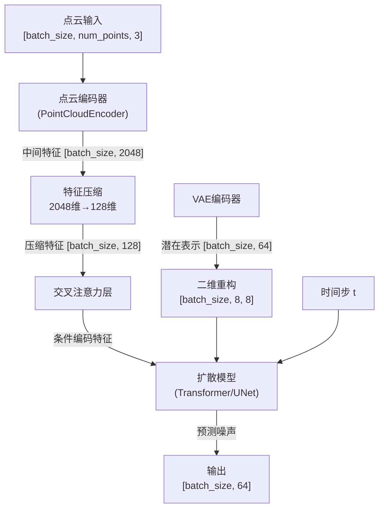
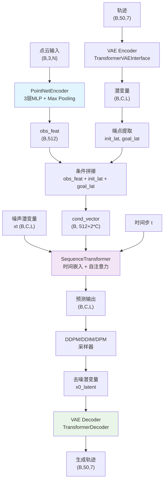

	SAM2里面自带语言模块，可以用语言当作指令来分割机械臂给的图像的焊缝。比如说机械臂拍一张图像，人可以给出指令：移动（reach）到大一点的焊缝。然后机械臂规划轨迹完成指令。我们的任务比较简单，一般只涉及到移动（reach）。

```
sam和seg former。
后面会对mask做研究。
和sam的point提示有点像，输入相机拍摄的实际图像和经验点坐标，模型输出实际点坐标。
200个数据。
```


## 4.22
- 在采用vedo库的boudaries方法的基础上试了多种算法，还是没能解决牙龈线提取的部分连接问题。

## 4.23
- 初始stl数据是mesh数据，上采样得到点云，点云输入模型。
- 点云用的是阈值分割，效果不错，因为原始模型就是点云输入点云输出；mesh用的等值线提取，效果很差。可能是因为在点云的颜色映射到mesh的点的颜色的过程的算法不太好？--不是的，是因为在predict函数中，点云坐标被处理时存在不对称的操作，导致处理后的点云在Z轴上产生了系统性偏移，从而使得基于点云生成的牙龈线与原始mesh不匹配。

```python
# 标准化阶段 - 对XYZ坐标进行处理
data_batch[:, 0] = data_batch[:, 0] - center[0]  # 中心化X坐标
data_batch[:, 1] = data_batch[:, 1] - center[1]  # 中心化Y坐标
data_batch[:, 0:3] /= block_size / 2.0  # 缩放XYZ坐标

# ...

# 反标准化阶段 - 恢复原始坐标
input[:, :3] += center  # 这里添加了中心点坐标，但center只有XY两个维度
input[:, :3] *= block_size / 2.0  # 缩放回XYZ坐标
input[:, :2] += centers[start_idx + ssbatch, :2]  # 只对XY坐标做了偏移调整
```

- 在牙龈线提取的部分连接问题上，牙龈线应该是一条相对平滑的曲线，沿着牙齿的边缘走，而不应该深入牙齿之间的缝隙。这些突出部分实际上是牙龈线错误地进入了牙齿缝隙。

## 4.24
- 刷了leetcode二分法。

- 使用简单的z轴对齐，解决了昨天z轴偏移的问题。

- 


在昨天和前天的牙龈线提取的部分连接问题上，因为突出的点很密集，所以传统的聚类和离群点算法无法处理。有以下思路：

1. **主曲线拟合**：首先拟合一条平滑的主曲线，代表牙龈的大致轮廓；然后偏差检测：计算原始点到主曲线的距离，偏离过大的区域可能是突出。
   - 首先拟合一条平滑的牙弓主曲线。
   
   - 计算每个点到主曲线的距离和投影。
   
   - 设定最大允许偏离距离，超过此阈值的区域被识别为异常突出。
   
2. **方向检测**：分析沿着牙龈线的切向量，如果切向量在某个区域变化剧烈，该区域可能是突出。

   - 计算曲线上相邻点形成的向量。

   - 分析向量角度变化率，识别角度变化剧烈的区域。

   - 当方向变化超过阈值时，可能是进入了牙缝区域。

3. **形态学处理**：可以使用形态学操作（如开闭运算）来平滑牙龈线轮廓。

   - 将牙龈线投影到平面上。
   - 应用形态学闭运算，填充小的内凹区域。
   - 应用形态学开运算，移除小的突出。
   - 将处理后的轮廓投影回原始3D空间。

## 4.27

- 尝试多种方法包括曲率过滤，但是，消除不了凸出部分。

- 刷了leetcode移除数组元素和有序数组的平方。

## 4.28

- 开会说了：

  - 现在用的点云数据输入模型，模型输出点云数据，但是还要经过点云重建为网格，重建的过程占用大量时间。优化的方向为输入数据改为网格，那么模型也会输出网格，省去时间，这样的话得动模型的整体架构。

  - 前几天尝试的vedo库的过滤试过上面提到过的3种方法效果都不好，遂抛弃。
  - 后面几天都用SFT的方法，用距离标签的形式重新训练模型看下效果。
  - 这些做完后后面还有焊缝检测和机器人的算法要了解。

- 刷了leetcode长度最小子数组。

## 4.29

- 折腾了一天的环境，还把在vscode上吧wsl误删除了，红温。

## 4.30

- 把pointcept和promptcblue的环境折腾好了。
- 打算后面刷题走：Acwing + hello-algo
- 学习了vscode 的调试，目前没找到Pycharm的远程调试(通过命令行的形式)。

## 5.1 

- 回去学docker和git
- 完成距离标签的训练，熟练使用vscode。
- 用vscode连接服务器调试promptcblue。

## 5.2-5.5

- 用test_pipeline.py测试，出现问题：有些网格被分割的很奇怪，无法修改牙龈线，我才是模型训练的原因，见到的数据太少了**过拟合**了；底层库的**内存访问**总是出问题，这点我不懂，暂时无法解决。所以我准备直接用仅有的别人标记好的pts数据先做训练，在先前训练权重的基础上训练，要注意先前训练的分类头是2，我现在基于距离的分类头是1。我目前已经把代码大体写出来，但是还是有点报错需要解决，目前看是问题出现在vedo自带的cut_with_point_loops方法中或者是pts文件中，明天解决这个问题，然后训练。

## 5.6


- 由于依据标记好的pts文件分割原始mesh为mesh0牙龈和mesh1牙齿的分割效果不太好（无论是单壳体还是多壳体），所以我打算修改算法思路，目前的算法是先分割在计算距离再根据距离打标签，但是由于分割效果不好所以会影响到标签的质量。所以我打算**不分割**，依据z坐标相对于牙龈线是上还是下判断，在原始mesh（包括牙齿和牙龈）上还是依据距离打标签。


- 把训练代码也改完了，只等看训练报不报错了。

## 5.7

- 第一次训练：

可能是学习率的设置变化过大，改进scheduler再次训练，同时添加第0个epoch先计算验证集loss。

- 第二次训练：

但是预测的经过sigmoid函数后的logit高度分布在0.5附近，**没有0和1这两个值**。

尝试解决方案：1.修改模型最后一层添加了point.feat = torch.sigmoid(point.feat)。

2.修改三峰损失函数的设计问题，增加了三峰分布权重。

## 5.8

- 下雨买药上课健身

## 5.9

- 5.7日的改进再训练依旧是这个问题没有解决。同时尝试了在sigmoid函数里面添加tempreature，改损失函数为二分类问题。后面打算用vscode远程ssh调试训练过程。

- 开会：后面的任务 1.了解强化学习；2.了解机器人运动；3.看论文；

## 5.10-5.11

- 改损失函数为MSE损失。

- 训练400个epoch，loss为0.04很难下降，预测最小值为0.03，最大值为0.8左右。


思考：通过实验结果发现，这样的在0.5附近的距离作为标签的形式可能不是一条正确的方向。

​	我们打距离标签的目的，不考虑误差的情况下，就是让模型预测的结果和我们的距离标签相契合，在0和1确定，在0.5附近波动，但是不打距离标签的训练的模型也会有这个能力。而且即使只有三个极值标签0、1、0.5，模型预测的话加上一点误差，pred_logit不也会在这些值附近小范围波动吗，这不就相当于距离标签的波动了吗？就是模型的预测结果不会是百分百准确，天然会带波动，这个波动的不就是我们想要在距离标签中模型学会的能力吗？

​	至于为什么模型的训练效果不好：最大的原因我猜是数据的重复性和差异很大，再就是学习率和批量大小的原因。

​	后面改进一下预处理函数，在目前的距离打标签的内容上加一个直接的三个极值标签的功能。

tips：目前的数据中有很多重复的模块，是否可以挑出一个手动打标签。

## 5.12

- 学习了DDPM原理，记了笔记DDPM.md。

## 5.13 

- 学习了强化学习，记了笔记RL.md。

## 5.14

- 阅读RobotDiffuse论文，记了笔记。
- 继续学习强化学习，需要一周的时间把强化学习理论xue'wan

## 5.15

- 继续读扩散模型应用到机器人轨迹规划的论文。
- 继续学习强化学习。

## 5.16

- 关于牙龈线标签的思考：最开始尝试vedo库的boundaries方法，但是总是有密集的突出，难以用算法过滤；再就是用少量数据训练过的ptv3模型直接打标签在手动微调，但是可能由于数据间的差异过大导致效果不好，并且容易引发底层库的内存报错；而且前面也尝试了距离标签回归的方式来做，但是经过分析不太可行；所以回到原点，挑出典型数据手打标签并用算法添加平滑处理，并且分类头设置为1。
- 开会说到：继续标记模型，可以先标几个试一下效果；继续看扩散模型的工作；继续学RL。

## 5.19

- 学习RL
- 改标记代码

## 5.20

- 改进cut_with_point_loop函数，使得在牙龈上泼溅的被错误识别为牙齿的点能正确识别。
- 手动提出报错segmentation fault的stl文件。
- RL

## 5.21

- 昨天的改进还是有问题

思考:my_cut_with_point_loop分割的牙齿和牙龈不是很好，但是发现得到的闭合的牙龈线效果很好，所以能不能不用被切割的牙龈和牙齿，只用这个牙龈线和原始mesh来打标签。

效果很好

## 5.22

- 尝试手动打标签来测试昨天的程序，这里打的标签点很稀疏，一百来个，但是效果在某些stl文件不错，牙龈线能大体上识别出来。看到了效果，可以继续手动打标签，手动剔除离谱的模型，准备开始训练。

- 强化学习学到了最后一章。
- 学习docker。

## 5.23

- 可以完成昨天没做完的内容

## 5.26

- 会配置docker desktop的代理；部署了M$\pi$Nets的docker环境。
- 强化学习b站数学基础部分学完了。

## 5.27

- 学习了AMP，线程进程，DP和DDP。
- 开会说用EDMP生成数据，用扩散模型轨迹规划。

## 5.28 

- 看了一天的代码，很难。

## 5.29

- 把online_planning的核心内容看懂了，代码使用最小二乘优化问题来规划轨迹，并且依赖多个损失函数（如姿态匹配、平滑性、避障等）。思考能否用扩散模型代替这个最小二乘优化方法？

> 用扩散模型代替现有的LeastSquaresProblem方法来进行机器人轨迹规划，目前的代码使用最小二乘优化问题来规划轨迹，并且依赖多个损失函数（如姿态匹配、平滑性、避障等）。现在我想用扩散模型来替代这个优化过程，输出未来的关节轨迹。 首先，我需要理解现有代码的结构和流程。根据代码，solve_online_planning函数调用了solve_online_planning_jax，其中定义了各种成本函数，并通过jaxls的LeastSquaresProblem进行求解。核心是通过优化这些成本函数来得到关节轨迹sol_traj，以及对应的位置和方向。 接下来，用扩散模型来替代这个优化步骤。扩散模型通常用于生成数据，例如图像生成，但在机器人轨迹规划中的应用可能需要考虑输入输出的适配性。扩散模型需要训练，或者使用预训练的模型来生成轨迹。 需要考虑以下几点： 
>
> 1. **接口规范**：扩散模型的输入应该是什么？现有的solve_online_planning_jax函数接收robot、robot_coll、world_coll、target_poses等参数，扩散模型需要类似的输入，但可能需要调整为模型接受的格式，比如状态向量或目标描述。 
> 2. **模型输入输出设计**：扩散模型的输入可能包括当前关节状态、目标姿态、环境障碍物信息，输出则是未来时间步的关节配置序列。需要确定如何将这些信息编码为模型的输入，以及如何解码输出。 
> 3.  **集成到现有代码**：需要替换solve_online_planning_jax函数中的优化部分，用扩散模型的推理代码代替。这可能需要修改函数结构，确保输入输出与原代码兼容。 
> 4.  **训练数据准备**：如果用户需要自己训练扩散模型，需要确定如何生成训练数据，可能使用现有优化方法生成的轨迹作为监督信号，或者通过强化学习等方式。 
> 5.  **性能与实时性**：扩散模型的推理速度是否满足实时在线规划的需求？可能需要模型轻量化或加速推理。 
> 6.  **不确定性处理**：扩散模型可能有随机性，需要设计以确保轨迹的可靠性，比如多次采样后选择最优解。 
> 7.  **接口兼容性**：扩散模型的输出需要与现有代码的数据结构一致，如sol_traj的形状和类型。 然后，我需要分步骤思考如何构建这个框架： **步骤一：确定扩散模型的输入输出** - 输入：当前关节状态prev_sols，目标姿态target_poses，障碍物信息world_coll_list，机器人参数等。 - 输出：未来timesteps步的关节轨迹sol_traj，位置sol_pos，方向sol_wxyz。 **步骤二：设计扩散模型的网络结构** - 可能使用Transformer或CNN来处理时间序列。 - 输入可能需要编码为向量形式，比如目标姿态转换为7维向量，障碍物信息可能转换为位置参数。 - 输出为关节角度的时间序列，每个时间步的num_actuated_joints个值。 **步骤三：数据准备** - 使用现有优化器生成大量轨迹数据作为训练集。 - 输入包括目标姿态、障碍物信息，输出为对应的关节轨迹。 - 可能需要数据增强，模拟不同环境和目标。 **步骤四：模型训练** - 损失函数可能使用MSE来预测关节角度。 - 集成物理约束，如关节限位和平滑性，可能需要自定义损失或后处理。 **步骤五：集成到现有代码** - 替换solve_online_planning_jax中的优化步骤为扩散模型的推理。 - 保持接口一致，确保返回的sol_traj等变量与原代码兼容。 **步骤六：接口规范** - 定义扩散模型的输入输出接口，确保与现有函数参数匹配。 - 可能需要封装模型推理为一个函数，接受相同的参数，并返回相同的类型。 **可能的挑战：** - 现有代码中的障碍物信息可能需要转换为扩散模型可处理的格式。 - 扩散模型的输出需要满足物理可行性，可能需要后处理层来修正关节限制。 - 实时性要求可能限制模型复杂度。
> 8.  **需要修改的现有代码点：** - solve_online_planning函数中调用的pks.solve_online_planning_jax部分替换为扩散模型推理。 - 保持其他部分不变，如可视化更新、时间步处理等。 **扩散模型框架需要注意的点：** - 输入数据的预处理，标准化关节角度和姿态信息。 - 输出的后处理，确保关节角度在允许范围内。 - 模型的部署，可能需要转换为JIT编译的函数以保持效率。 最后，我需要将这些思考整理成一个清晰的框架，包括接口规范和修改点，帮助用户实施他们的思路。

- 赶汽车论文 

## 5.30

- 看RobotDiffuse思考：1.我觉得点云特征Z和目标关键位姿的拼接是否可以有改进的地方，因为点云特征Z是512维，但是初始和目标位姿是7+7=14维，二者输入降维网络维度变为512维，位姿点云维度相对比点云特征的维度占比很低，我不知道论文提到过这一点没有。2.在第一点的基础上，我还想到，点云的稀疏程度和作为障碍物来说没什么区别，因为机器人任务是躲避障碍物点云，这个过程和点云的稀疏程度没什么关系，所以，是否可以优化点云编码器来实现？有没有论文实现过这一点呢？
- 学习MPD+、MPD、M$\pi$Nets、EDMP论文。

## 6.3

- 温习论文，配EMDP的环境。
- 调试EDMP。

## 6.4

- 调试完EDMP，缺少训练代码，寻找创新点，写在《论文思路》里面。

## 6.5

- 梳理《论文思路》，发现需要深入了解diffusion model数学原理，推导公式。

- 学习VAE，变分推理，ELBO。

- 开会讨论说：数据集的场景比较简单，看下MPD的数据集部分；实际场景更复杂，会发生变化，需要一个通用的模型；关键点技术可以看看别人的工作；在时间步T上看怎么做手脚增快推理过程。

## 6.6

- 深入学习学习贝叶斯公式，彻底搞懂了VAE和DDPM。
- 深入看MPD+的论文，没看完。
- 用VAE来编码关键点到潜在空间？

## 6.9

- 研究MPiNets的数据集，HDF5文件中储存几何参数，包含所有时间步的trajectories。障碍物点云是动态生成的。

- 写VAE的代码：{

  我目前有train.hdf5和val.hdf5数据文件，数据文件的格式在demo.py中的注释部分有写道。现在问题是原始专家轨迹包括50个时间步的轨迹，我想用VAE来提取专家轨迹中的关键点，VAE的训练思想如下：损失函数包括重构损失和KL散度项，一个训练好的VAE我需要编码器部分来提取专家轨迹的关键点，再把这些关键点加噪输入扩散模型，训练好的扩散模型可以直接输出关键点，VAE的解码器部分用来重构扩散模型输出的关键点轨迹为稠密轨迹。VAE可以先单独训练看看效果。请你写VAE架构的代码、VAE训练的代码、扩散模型训练的代码等等。要求：代码有良好的可拓展性，代码和代码文件结构清晰，尽量多用接口写法，和EDMP的原代码和接口有较好的融合。}

## 6.10

- 小批量数据训练VAE，可视化重建的轨迹与原始轨迹对比。


## 6.11

- Latent Diffusion Model 。
- 找训练的问题，模型大了用的训练集比例小了。加大规模继续训练VAE。
- 开始写扩散模型部分代码。



## 6.12

- 昨天训练的VAE重建效果依然不好：


- 优化VAE架构：注意力加权池化和残差连接。优化损失函数：添加关键点损失。继续训练：

  


- 找把LDM用到机器人轨迹相关的论文：RoLD；D-Cubed
- 决定使用不对称网络架构：3+6 transformer 训练。

## 6.13

- 看实验效果——很差。又进行了架构上的改进，具体在《论文思路》，继续训练。
- 看论文；继续找创新。
- 做汇报ppt。

## 6.16

- 改进VAE架构做对比实验。
- 读VAE和diffusion在轨迹规划领域的论文。

## 6.17

- k10_96_suc1：


- 在k10_96_suc1上继续实验：相比原始suc1（上图）添加了速度和加速度惩罚，增加了transformer的维度从256到384。
- 在k10_96_v2.0上继续实验：相比原始suc1（上图）添加了速度和加速度惩罚，增加了transformer的维度从256到384，添加了resblock和attention pooling、分层 ConvTranspose1d 上采样 + Skip-Connection。

- 做关于VAE和扩散模型的PPT，学习了传统轨迹规划领域的方法比如RRT、CHOMP等。

## 6.18

- 继续实验suc1和v2.0，降低速度和加速度平滑，降低d_model为192，降低latent dim为4。实验中止，太费钱了，思考搞服务器。
- 改代码使得代码版本更规范。
- 目标：先改代码版本。在看论文，边看论文边做PPT。

## 6.19

- 看论文，边看论文边做PPT。

- 可视化出问题，重新改进loss函数（加了ee mse 和 joint weight）继续训练。

- 思考：1.如何处理点云数据，什么是sdf？2.全局和专家规划路径的区别？

  ```
  hybrid_solution = 50×7 Panda 关节角序列（你当前 VAE 输入）；
  global_solution = 50×7 Panda 关节角序列；
  ```

## 6.20

- v0.4训练效果明显改善，思考扩散模型的架构和训练——有多种方式。
- 可视化了v0.4的潜空间，效果较好。

- 后面打算开始写扩散模型的训练策略以及考虑障碍物的引入方式，还有时间步T的选取。

## 6.21

- 读论文，发现RoLD和我的思想很像，是把一个用固定长度的滑动窗口将长序列短序列用VAE压缩成（1，latent_dim）的形式。思考能不能动态选择关键点的数量（一个轻量级神经网络来决定）？能不能再把latent_dim降维？

## 6.22

- 后面目标：着手完成扩散模型的代码和训练，看下效果。在考虑长序列、动态关键点、降维、更通用的VAE等等方法。

## 6.23

- 写了diffusion的架构和训练代码。梯度引导方法由于其速度原因暂时搁置，改用在扩散模型的条件输入障碍物场景点云的形式。

## 6.24

- 上午把整个流程的框架和代码写好了。点云障碍物作为条件输入，损失函数包括扩散模型的噪声预测MSE加上经vae decoder重建后的轨迹与原始轨迹的MSE。

- 修复凹入牙齿 STL 内部的牙龈线点及其法向量的算法，明天加一个功能：距离近邻和点近邻同时可选择。

## 6.25

- 写好了点云编码器架构和训练部分。
- 改进修复凹入牙齿 STL 内部的牙龈线点及其法向量的算法在多壳体的表现——目前两个痛点：一个是r和k适合不同的stl文件，暂时无法自动选择。第二个是多壳体需要用vedo库split成单壳体在和单壳体一起用算法重建牙龈线和法线。

## 6.26

- 解决修复凹入牙齿 STL 内部的牙龈线点的两个痛点。
- 思考点云编码器中对障碍物处理思路的上/下采样策略。

## 6.27

- 增加扩散模型推理代码，能量梯度引导和 CFG：同时训练“有条件”与“无条件”两种前向，推理时做线性插值。

## 6.30

- 检查pointnet2的训练代码，确保可以运行。
- 读文献，做ppt。
- 目前的扩散推理的代码有缺陷：**没有对机器人自身建模**，EGD只包括了EE的碰撞和平滑，并没有包括机器人自身的碰撞。
- 目前EDMP、MPD、Robotdiffuse都用了梯度引导。目前的扩散模型的训练和推理过程都是纯DDPM。使用**DDIM在推理阶段**（训练阶段和DDPM一样）可以加速采样过程但是减少随机性。

## 7.1

- CLAD：潜空间注入（相加）只发生在推理过程中，为什么有效？**除非VAE的训练是在训练完扩散模型后冻结扩散模型单独训练的。**

- D-Cubed：核心是在扩散模型的推理中使用**采样-评估-选择”的无梯度**方法。
- RoLD：核心思想是解耦动作轨迹的编码和控制策略的生成：第一步用自编码器ATA学习一个输入为**一小段轨迹和环境**的潜空间，损失函数为recon + kld；第二步训练一个在这个潜空间的扩散模型，输入为轨迹噪声 + 环境 + 文本，输出为轨迹潜变量。
- **CLAD、D-Cubed、RoLD**均为无梯度方法，**Robotdiffuse、MPD+、EDMP**均为有梯度方法。

## 7.2

- 思考初始和目标位姿是**首尾固定**or**首尾编码**，**输入端**or**输出端**。目前的条件是（256+16+16）维，后面要是效果不好的话可考虑分支投影再融合来同步位姿和障碍物特征维度。
- 开始训练点云编码器，他的处理瓶颈在cpu，考虑离线方法。3270k轨迹太多的，训练时间太长，用327k轨迹和场景训练点云编码器。

## 7.3

- 在训练点云编码器的时间多看代码。
- 1.可视化目前FPS上采样策略下的障碍物场景，是否有其他更合适的上采样策略？ 2. ΜπNets 的大规模数据集是使用 **Franka Emika Panda 7自由度机器人模型**（基于其标准URDF）生成的。目前的DH参数是否要改成urdf？

## 7.4

-  重点看文献的数据集和实验部分。
-  在windows创建一个新edmp的环境。
-  思考：**能否自己创建一个数据集：先生成轨迹在填充障碍物？**

## 7.7

- 折腾新轨迹障碍物数据集的障碍物放置逻辑，有了一个初步的成效。后面考虑加速生成的逻辑。

## 7.8

- 折腾加速生成的逻辑。
- 后面考虑把**Franka Emika Panda 7自由度机器人模型**（基于其标准URDF）换成ABB的1300机器人，目前还是先用Panda验证流水线。

## 7.9

- 成功生成了mpinets和新场景两个数据集，生成完后把两个数据集合并开始训练点云编码器。

## 7.10

- 配套改动扩散模型的train和sample代码。采用直接**从URDF提取参数些torch版本的FK**。
- writer的写法有点问题，不论是训练点云编码器的writer还是扩散模型的。明天改writer和看扩散模型的训练和推理的代码。

## 7.11 

- 在train latent diffusion 和 sample latent diffusion中添加： **Cosine β + EMA + AMP +  v-prediction + DPM-Solver**。
- 后面的任务：1.过一遍训练和推理的代码。2.点云编码器训练完看效果。

## 7.14

- 扩散模型训练代码优化完毕，训练不报错。
- 点云编码器重建可视化的结果很差，为一团簇。原因为：**没有归一化、中心化，PointNet2 输出的全局特征很难同时编码“形状 + 三维平移”**。
- 后面改进点云编码器，扩散模型的训练代码不用动。

## 7.15

- 加了**逐场景归一化、中心化**后，再次训练点云编码器。

## 7.16

- 加了**逐场景归一化、中心化**后的点云编码器效果依然很差，塌缩成一团：把所有点「收缩」到质心附近——说明 网络找到了一条“捷径” 来最小化 Chamfer Loss，而不必真正复原形状。所以问题很可能处在loss函数上。加上**Repulsion**损失。效果还是不好，找问题ing。

## 7.17

- 加Repusion后变成了均匀的团。现在换上了**多patch**的折叠网络。

## 7.18

- 点云编码器的训练逻辑：重建的好说明能辨别场景，**可能**对下游有利。
- 改为点云编码器、corr mlp、decoder、扩散模型为**联合训练**，不单独训练点云编码器。

## 7.21

- 改进joint训练代码的tensorboard和sucess部分。
- 写了capeformer在钢材上测试的代码。

## 7.22

- 分析结果，在自碰撞中加入**torlerance**参数。

## 7.23 

- 重新生成数据集：使用**Hybrid轨迹训练（以任务为中心）**，而不是Hybrid和Global（以机器人为中心）混用。
- 修复训练代码和推理代码。修复tensorboard、EMA断点续训 ，修复coor mlp输入的逻辑（首尾帧固定），修复推理代码dpm_solver在用专家轨迹的起终点时首尾帧不固定的bug。

## 7.24

- 在训练代码中加入**时间步依赖的损失加权** 。**三个不同域：潜空间、vae输出、corr mlp输出。**计算损失。推理代码加入**能量引导随时间步的缩放**，为**dpm-solver添加能量引导。**

- 由于障碍物和机器人的最小距离参数不同，目前**只用新数据集训练流水线**。

## 7.25

- 过一遍训练代码，发现：**1.EMA目前只是用在了扩散模型上，没有用到整个流水线上。2.思考分层损失和Min-SNR-γ。3.思考关于碰撞的问题：碰撞成功率的判定以及碰撞loss和数据集的关系。**4.改动loss在tensorboard的显示，需要乘系数以便观察。5.配套改动推理代码和sh脚本。6.推理的能量引导带不带权重？7.训练和数据生成的机器人异同。
- 然后再开始训练。

## 7.26

- 做ppt。

- 一个连杆由多个相交的球体组成，修改自碰撞的允许自碰撞矩阵acm的生成逻辑。

  

  ```mermaid
  flowchart LR
      %% Main components with English labels
      Data["Dataset<br/>Joint Trajectories & Obstacles"] --> VAE["VAE Training"]
      Data --> Diff["Latent Diffusion Training"]
      VAE --> |"Pretrained"|Diff
      Diff --> Infer["Inference"]
      
      %% VAE Training details with corrected structure
      subgraph VAE
          direction TB
          enc["Transformer Encoder"] --> lat["Latent Space (L×C)"]
          lat --> dec["Transformer Decoder<br/>ConvTranspose1d"]
          dec --> recon1["Reconstructed Trajectory"]
          recon1 -.- loss["VAE Loss"]
      end
      
      %% Diffusion Training details
      subgraph Diff
          direction TB
          frz["Frozen Encoder"] --> x0["Latent x₀"]
          x0 --> noise["Forward Noising"]
          noise --> model["Seq Transformer<br/>(v-predictor)"]
          
          cond["Conditioning"] --> model
          
          model --> pred["Prediction"]
          pred --> recon2["Decoded Trajectory (recon_raw)"]
          
          recon2 --> corrMLP["Correction MLP"]
          corrMLP --> recon3["Corrected Trajectory (recon_for_mse)"]
          
          recon2 -.- physLoss["Physical Domain Losses"]
          recon3 -.- geomLoss["Geometric Domain Losses"]
          
          physLoss -.- snr["Min-SNR-γ Weighting"]
          geomLoss -.- snr
      end
      
      %% Conditioning subgraph
      subgraph cond
          direction LR
          pnet["PointNet2"] --> feat["Obstacle Features"]
          ep["Endpoints"] --> vec["Condition Vector"]
          feat --> vec
      end
      
      %% Inference workflow
      subgraph Infer
          direction TB
          noise2["Random Noise"] --> denoise["DPM-Solver"]
          cond2["Obstacle + Endpoints"] --> denoise
          denoise --> dec2["VAE Decoder"]
          dec2 --> corr["Correction MLP"]
          corr --> final["Final Trajectory"]
      end
  ```


## 7.28

- 成功解决自碰撞的问题。
- 采用loss scheduler训练策略。

## 7.29

- 看论文，训练模型。

## 8.1

- 可视化seqtransformer内部**不同条件下**的10个关键帧的attn图，发现只有第0个第9个token会注意到其他token，中间的token什么都不会注意到包括他们自己，意味着它认为“我当前的状态是什么，对于决定我下一步的状态并不重要”。这时候模型的任务变成一个**简单无条件的插值器，只和首尾关键token有关**。
- **LayerNorm 来归一化拼接后的条件向量，cond_proj 线性层进行了零点初始化，将 PHYS_LOSS_START_EPOCH 设置为了 0**，为防止vae decoer对这种错误结果微调来降低损失，所以也要**关闭vae decoder微调和corr MLP**。
- 学习率降为5e-5？

## 8.2

- 点云数据加归一化，并把pointnet2的BN换成LN。
- 数据集：取消「每样本中心化 + 单位球缩放」；PointNet2：显式 LayerNorm 保持数值幅度；Shell 脚本—调整 λ 权重。

## 8.3 

- 重写pointnet2代码。
- 删除FiLM使用Cross Attn。

## 8.4

- 重写pointnet代码，删除条件向量的cross attn，使用三层MLP作为pointnet编码器。



## 8.5

- 3层MLP的点云编码器用来训练推理效果还不错，起码有成形的轨迹了。

## 8.6

- 评估只有44%的成功率，太低了。改变参数继续训练。

## 8.7

- **专家轨迹出了问题**，重写场景生成函数，重新生成场景。
- 看新生成场景的代码，生成新场景，测试专家轨迹的成功率，重新训练模型。
- 学习了一点**PPO**。

## 8.9

- 

但是点云编码器和注意力图的表现还有提高的余地。

## 8.10

- 改点云编码器和条件融入方式训练。

## 8.27

- 准备用MPD来推理KTD的数据集，看看成功率。今天配好了环境，写了预训练扩散模型的代码。

## 8.28

- 看看加了梯度引导后KTD的成功率怎么样。无条件扩散模型的成功率为73%，即初始条件成功率就为73%了，后面在梯度引导、微调。这是个很好的方向。
- 复现MPD。

## 8.29

- KTD的梯度引导出现了问题，效果不升反降，找代码漏洞并修复。

## 8.30-8.31

- 继续KTD的梯度引导 + 训练MPD。

## 9.1-9.2

- 成功率有突破，目前KTD的碰撞成功率达到了82.7%。

## 9.4

- 发现从dist dim = 1 切到dist dim =3效果反而变差了。

## 9.5

- 碰撞成功率在加了后处理，调了超参数后来到了93%，再加一个CFG让平滑度上升了几个点。

## 9.6

- 下载eval_results.hdf5可视化推理得到的轨迹。
- 致力于MPD。

## 9.7

- MPD评估代码按照AI修改了，但是还没有试运行。

- KTD让AI给了思路但是没有让AI修改。

## 9.8

- 开始丁师兄第六章。
- 继续优化了KTD，服务器的代码都已经改好，运行了明天看结果。
- MPD + KTD 的评估还在让AI分析，还没让他改，服务器也没让他改。

## 9.9

- KTD目前的部分轨迹存在的抖动一般发生在起始阶段；KTD倾向与走直线？;KTD的可视化脚本还有改进之处，机器人不跟轨迹。——FK的问题；看抑制抖动的实验结果。
- 继续优化MPD的评估脚本。——看评估指标的代码以及存在的显存问题。

## 9.10

- FK已经写入readme；抖动抑制不理想；评估指标的代码以及存在的显存问题改进了还没实验。

## 9.11

- 本地改抖动中。

## 9.12

- 本地改抖动中。
- 写论文中。

## 9.13

-  把VAE的非重叠反卷积上采样改为重叠反卷积上采用重新训练。
- 改评估代码匹配原生MPD中。

## 9.14

- 重新生成导出327000个global的new_obs_traj_data.hdf5。
- 昨天训练的vae有问题，重训vae。

## 9.15

- 重训KTD的扩散模型，训练完后开始推理看效果。
- 重训MPD，放到1080ti或者3060上。训完在评估MPD。

## 9.16

- 用重叠上采样的VAE在训一个新的KTD基线模型的训练成功率来到了80%！
- 目前新的VAE训练的新的扩散模型的推理效果不理想，改进推理脚本中。

## 9.17-9.18

- 继续优化KTD推理代码，想达到不重叠VAE的效果。
- 思考五菱项目。

## 9.19

- 学习张量并行、流水线并行、数据并行。
- 优化KTD推理代码。

## 9.20-9.21

- 优化KTD推理代码。
- 学习大模型，打算细水长流，打持久战来学习，期间要做好笔记。
