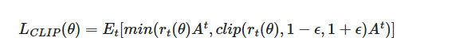

### 1.==用一句话谈谈你对于强化学习的认识==

强化学习包括**环境、动作和奖励**三部分，本质是通过智能体与环境的交互，让智能体所做的决策所得到的奖励最大化。

### 2.==强化学习与无监督学习和监督学习有什么区别？==

| 特征   | 监督学习 (Supervised Learning) | 无监督学习 (Unsupervised Learning) | 强化学习 (Reinforcement Learning) |
| ---- | -------------------------- | ----------------------------- | ----------------------------- |
| 目标   | 预测输出/分类                    | 发现数据内在结构/模式                   | 学习最优策略以最大化长期奖励                |
| 输入数据 | 带标签的数据 (特征, 标签)            | 无标签的数据 (特征)                   | 无预设数据集，通过与环境交互产生              |
| 反馈机制 | 直接、明确的反馈（告知正确答案）           | 无外部反馈（基于数据内在联系）               | 间接、延迟的评估性反馈（奖励/惩罚）            |
| 核心问题 | “这是什么？” / “是多少？”           | “它们有何共同点？” / “如何分组？”          | “接下来该怎么做最好？”                  |
| 类比   | 跟着老师和答案学习                  | 自主探索和发现模式                     | 通过试错和奖励学习技能                   |
|      |                            |                               |                               |

### 3.==什么是马尔可夫过程？马尔可夫决策过程？马尔可夫性质？==

- **马尔可夫过程**是，系统在未来将处于哪个状态，**仅仅取决于它当前所处的状态**，而与它过去是如何到达当前状态的路径（即历史状态序列）无关。

- **马尔可夫性质** 的正式定义是：**未来只与现在有关，与过去无关**。

- **马尔可夫决策过程**在马尔可夫过程的基础上，**加入了行动（Action）和“奖励（Reward）**，一个马尔可夫决策过程由五个元素构成 (S,A,P,R,γ)。

### 4. ==value-based和policy-based方法的区别是什么？==

Value-based 方法通过计算每个状态下**所有动作的期望回报**，机械地选取最高分动作来决策，因此在离散动作空间表现稳健但难以处理连续动作；Policy-based 方法则致力于**直接优化“行为概率”**，绕过价值估算，直接调整动作输出的分布以最大化总回报，天然适配连续控制与随机策略，但由于缺乏价值锚点，优化过程往往波动剧烈。

### 5.==简述PPO算法==

### 6. ==简述TRPO算法==

在 TRPO 出现之前，策略梯度（Policy Gradient）算法有一个巨大的痛点：步长（Step Size/Learning Rate）太难选了。

- **步长太大**：策略更新太猛，新策略可能一下子跑偏了，导致表现剧烈下降（Collapse），而且很难再恢复回来（因为数据是基于策略采样的，策略坏了，采回来的数据也是烂的）。
    
- **步长太小**：训练速度慢如蜗牛。

TRPO 的核心思想是：**“为了安全，我能不能限制每次策略更新的幅度，让新策略和旧策略不要差得太远？”**
这就引出了 “信任区域（Trust Region）”的概念：我们在旧策略周围画一个圈（区域），只要新策略在这个圈里，就是安全的（值得信任的），我们可以放心大胆地更新；如果超出了这个圈，就不行。

它的优化目标变成了这样（这是一个**带约束**的优化问题）：
- **目标：** 最大化期望回报（让策略变好）。
- **约束：** $KL(\pi_{old} || \pi_{new}) \le \delta$

### 7. ==model-based和model-free的区别？==

这里的model指环境模型，而不是agent。

具体来说，环境模型包含两个核心预测能力：

1. **状态转移** $P(s'|s, a)$：如果我在状态 $s$ 做动作 $a$，下一步会变成什么样？
    
2. **奖励函数** $R(s, a)$：做这个动作，我会得到多少分？

Q-Learning, DQN, Policy Gradient, Actor-Critic, PPO, TRPO 全都是 Model-Free 的！

### 8. on-policy和off-policy

**一句话判断：** 如果你看到一个算法里有 **“Replay Buffer” (经验回放池)**，那它大概率是 **Off-Policy** 的；如果是采一批数据算一下梯度然后马上扔掉，那它就是 **On-Policy** 的。

### 9. 什么是DPO

传统的 RLHF (使用 PPO) —— 复杂的三步走

以前要让模型学会“人类的喜好”（比如回答要礼貌、不要乱编），我们需要三个繁琐的步骤：

1. **SFT (有监督微调)**：先教模型学会说话。
2. **训练奖励模型 (Reward Model)**：找老师打分，训练一个专门的“裁判模型”，它能判断哪句话说得好（给高分），哪句话说得差（给低分）。
3. **使用 PPO (强化学习)**：让大模型对着“裁判模型”不断尝试生成句子。如果裁判给高分，PPO 就更新参数鼓励这种生成；给低分就惩罚。

**痛点：** 第 3 步的 PPO 太难训练了！它不稳定、极其消耗显存、对超参数非常敏感，还需要同时加载大模型、裁判模型、参考模型等，工程难度极高。

DPO 的作者斯坦福团队提出了一个天才的想法：**为什么要训练一个额外的“裁判模型”呢？**

通过复杂的数学推导（这一点非常精彩），他们证明了：**大语言模型本身就可以隐式地充当奖励模型。**

这意味着，我们可以跳过“训练裁判”和“PPO 试错”这两个步骤，直接用人类的偏好数据（A 优于 B）来优化模型。

- **PPO 的逻辑**：先训练个裁判，然后通过不断的试错（采样）来讨好裁判。
    
- **DPO 的逻辑**：直接拿这堆数据告诉模型——“看好了，这句话（A）比那句话（B）好，你要提高生成 A 的概率，降低生成 B 的概率。”

这就是为什么叫 **“直接（Direct）”** 偏好优化。

它的损失函数只做两件事：
1. **增加“好回答” ($y_w$, winner) 的概率**。
2. **降低“坏回答” ($y_l$, loser) 的概率**。

### 10.