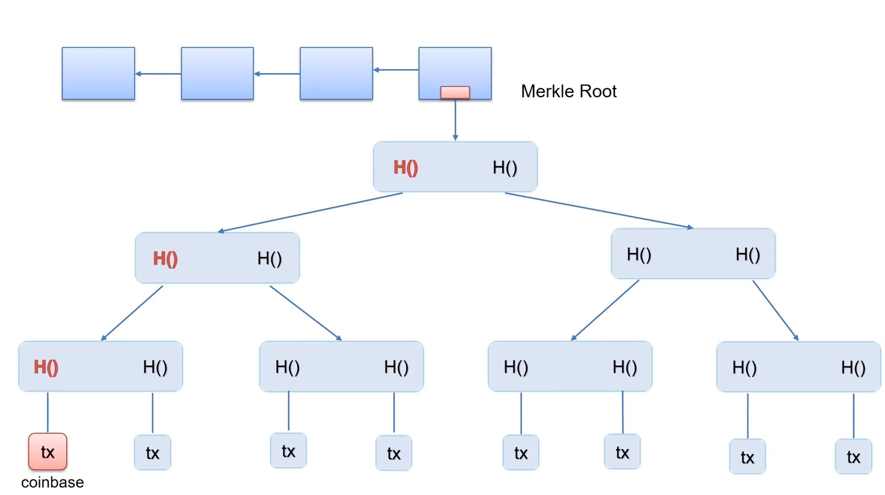

签名 = 交易 × 私钥；公钥 = 私钥 × 椭圆曲线。
验证用的等式：**签名 × 椭圆曲线 = 公钥 × 交易**，如果这个式子成立，那么就说明 **公钥 = 私钥 × 椭圆曲线** 也就是公私钥是配对的。

去中心化的货币要解决两个问题：
1.怎么决定货币什么时候该发行，发行多少？——比特币中由挖矿决定
2.怎么验证交易的有效性，怎么防止双花？
	需要维护一个数据结构，由所有的用户共同维护，这个数据结构就是区块链。

挖矿实际上求hash只用到了block header（block header里面包括nounce，挖矿会不断调整这个nounce以及coinbase里面的自定义内容）里面的内容，交易的具体信息在block header里面是没有的，block header里面只有一个 merkle trea 的根hash值就够了。

BTC中没有账户的概念，要付出的代价就是 transaction based ledger，也就是每个交易都得说清楚你的这个币是从哪来的，没有 “账户” 这种概念。
ETH是 account based ledger 